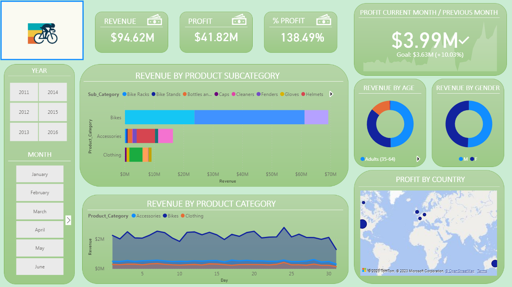

 

### Description
In the dynamic world of bike sales, having access to real-time data insights is crucial for businesses to stay competitive and maximize their revenue. This project aims to deliver a comprehensive analysis of bike sales data using Microsoft Power BI. Through interactive visualizations and in-depth reporting, the repository facilitates informed decision-making processes and helps businesses understand their market better.

### Features
Utilization of Power BI to create interactive and insightful data visualizations.
User-friendly visualizations, enabling non-technical users to explore and understand the data easily.
Uncovering correlations and trends to aid in strategic decision-making.

### Requirements
Power BI Desktop  
Microsoft Excel (optional, for data preprocessing)

### Data
The data used for this analysis is available in the data directory. It can also be found on kaggle [[HERE]](https://www.kaggle.com/datasets/sadiqshah/bike-sales-in-europe)
.
